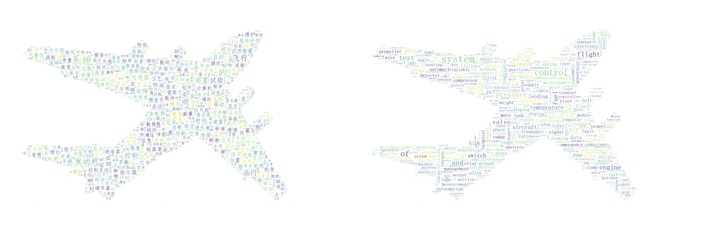

# 统计词频并根据图片生成词云-支持中英文
wfwc (Word Frequency and Word Cloud)

根据Excel表格内容统计词频，及词汇发生的频率，并且生成词云图片。

预设条件：

1. 请提前安装好`python3`
2. 准备好词库excel文件

## 1. 使用步骤
- `https://github.com/fenglixa/wfwc.git`
- `cd wfwc`
- `pip3 install -r requirements.txt`
- `python excelCount.py excelName sheetName columnNumber`
- - 替换 excelName 为你的 Excel 词库文件路径及名字
- - 替换 sheetName 为你的 Excel 词库表单名字
- - 替换 columnNumber 为你的 Excel 词库bi

**运行过程示例**
```
# python excelCount.py data/data.xls 英汉 1
Building prefix dict from the default dictionary ...
Loading model from cache /var/folders/_s/4bdbvdrs655gnsyvky53tbc40000gn/T/jieba.cache
Loading model cost 0.676 seconds.
Prefix dict has been built successfully.
Word frequency result was saved at frequency_result.xlsx
```


## 2. 输出文件
- 词频结果会保存到文件 "frequency_result.xlsx"
- 词云图片会保存到文件 “pic/wc_pic.png”

## 3. 更多功能
- 替换图片：
> 替换你自己的图片，只需替换文件 `pic/background.png` 即可

- 禁用词汇：
> 禁止显示某些词汇，修改文件 `src/stopwords.txt`,添加你的禁用词汇即可
